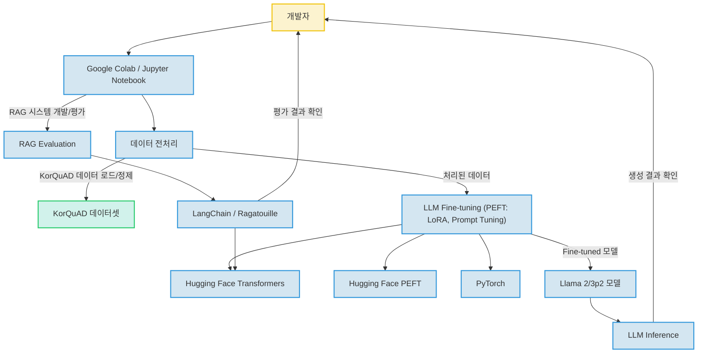

# Unknown Project


이 저장소는 Hugging Face Transformer 강의 자료를 기반으로 하는 프로젝트로, 최신 자연어 처리(NLP) 및 대규모 언어 모델(LLM) 기술을 학습하고 실습하기 위한 목적으로 제작되었습니다. LLM 미세 조정(Fine-tuning), Parameter-Efficient Fine-Tuning(PEFT) 기법, Retrieval Augmented Generation(RAG) 시스템 구축 및 평가 등 다양한 고급 NLP 주제를 Jupyter Notebook 환경에서 탐구합니다. 본 프로젝트는 면접 및 포트폴리오 제출을 위한 저의 기술 역량을 보여주는 자료로 활용될 수 있습니다.

## 주요 기능

이 프로젝트는 다음과 같은 핵심 기능 및 학습 내용을 포함합니다:

*   **LLM Fine-tuning 실습**: Llama 2 및 Llama 3p2 모델을 KorQuAD v1.0 데이터셋에 미세 조정하는 과정을 상세히 다룹니다.
*   **PEFT(Parameter-Efficient Fine-Tuning) 기법 적용**: LoRA(Low-Rank Adaptation)를 포함한 다양한 PEFT 기법을 사용하여 대규모 모델을 효율적으로 최적화하는 방법을 시연합니다.
*   **RAG(Retrieval Augmented Generation) 시스템 평가**: LLM-as-a-judge 방식 등을 활용하여 RAG 시스템의 성능을 평가하고 개선하는 방법론을 제시합니다.
*   **기초 NLP 작업 실습**: Hugging Face Transformers 라이브러리를 활용한 모델 로딩, 토크나이징, 파이프라인 사용 등 기본적인 NLP 작업을 익힙니다.
*   **데이터 전처리**: KorQuAD와 같은 실제 데이터셋을 LLM Fine-tuning에 적합한 형태로 전처리하는 과정을 보여줍니다.
*   **자동화된 모델 훈련 및 추론**: `autotrain-advanced` 라이브러리를 활용한 모델 훈련 및 추론 환경을 (추정) 구축하고 성능을 비교합니다.

## 프로젝트 구조

이 프로젝트는 주로 Jupyter Notebook 파일들로 구성되어 있으며, 각 노트북은 특정 NLP 또는 LLM 주제에 대한 실습 및 학습 내용을 담고 있습니다. 현재 구체적인 디렉토리 구조 정보는 제공되지 않지만, 파일명에서 유추할 수 있듯이 `NLP`, `PEFT`, `Open-Source` 등의 카테고리로 구분될 것으로 예상됩니다.

## 핵심 파일 설명

프로젝트의 핵심 파일과 그 역할은 다음과 같습니다:

*   **`README.md`**: 프로젝트의 전반적인 목적이 'Hugging Face Transformer 강의 자료'임을 명시합니다. 이 파일을 통해 프로젝트의 학습 지향적인 성격을 파악할 수 있습니다.
*   **`Llama3p2_fine_tuning_korquad.ipynb`**: KorQuAD v1.0 데이터셋을 다운로드하고, 이를 Llama2 학습을 위한 프롬프트 형태로 정제하여 JSON 파일로 저장하는 과정을 상세히 보여줍니다. (노트북 내 마크다운 셀에 'Llama2 학습을 위한 Prompt 형태로 정제'라고 명시되어 있으나 파일명은 Llama3p2인 점은 추후 확인이 필요합니다.) 이는 대규모 언어 모델 Fine-tuning을 위한 데이터 전처리 과정을 이해하는 데 중요합니다.
*   **`Llama2_inference_korquad.ipynb`**: KorQuAD 데이터셋으로 Fine-tuning된 Llama2 모델의 추론 성능을 측정하고 평가하는 과정을 다룹니다. `autotrain-advanced` 라이브러리 사용을 통해 자동화된 Fine-tuning 및 평가 환경에서 추론을 수행하는 것으로 추정되며, (추정) ChatGPT(GPT-4)와 같은 다른 모델과의 성능 비교를 목표로 합니다.
*   **`NLP/2_using_transformers.ipynb`**: Hugging Face Transformers 라이브러리를 사용하여 모델 로딩, 토크나이징, 파이프라인 활용 등 기본적인 자연어 처리 작업을 수행하는 방법을 실습하는 파일입니다. 라이브러리 초심자에게 매우 유용한 시작점 역할을 합니다.
*   **`PEFT/PEFT_LoRA_methods.ipynb`**: Parameter-Efficient Fine-Tuning(PEFT) 기법 중 가장 널리 사용되는 LoRA(Low-Rank Adaptation)의 이론과 다양한 적용 방법을 실습하는 노트북입니다. 이를 통해 효율적인 모델 최적화 기법을 학습할 수 있습니다.
*   **`Open-Source/rag_evaluation.ipynb`**: Retrieval Augmented Generation (RAG) 시스템의 평가 방법론에 초점을 맞춘 노트북입니다. LLM을 활용하여 합성 평가 데이터셋을 생성하고, RAG 시스템의 정확도를 계산하는 과정을 다루며, RAG 시스템 개발 및 개선에 있어 핵심적인 평가 기술을 보여줍니다.

## 기술 스택

이 프로젝트에서 활용된 주요 기술 스택은 다음과 같습니다.

*   **개발 언어**:
    *   **Python**: 머신러닝 및 딥러닝 프로젝트의 핵심 개발 언어로, 유연성과 풍부한 라이브러리를 바탕으로 활용 능력을 보여줍니다.
*   **개발 환경**:
    *   **Jupyter Notebook / Google Colab**: 대화형 개발 환경으로 데이터 분석 및 모델 실험을 신속하게 수행할 수 있음을 입증합니다.
*   **주요 라이브러리 및 프레임워크**:
    *   **Hugging Face Transformers**: 최신 NLP 모델을 로드, 활용 및 미세 조정하는 데 능숙함을 나타냅니다.
    *   **Hugging Face PEFT (Parameter-Efficient Fine-Tuning)**: 제한된 자원으로 대규모 언어 모델을 효율적으로 미세 조정하는 기술을 습득했음을 보여줍니다.
    *   **PyTorch**: 업계 표준 딥러닝 프레임워크를 사용하여 복잡한 모델을 구축하고 훈련하는 역량을 갖추고 있습니다.
    *   **Hugging Face Datasets**: 다양한 데이터셋을 효율적으로 로드, 전처리 및 관리하여 NLP 파이프라인을 구축할 수 있습니다.
    *   **LangChain**: LLM 기반 애플리케이션, 특히 RAG(Retrieval Augmented Generation) 시스템을 설계하고 구현하는 능력을 보여줍니다.
    *   **sentence-transformers**: 텍스트 임베딩을 생성하여 시맨틱 검색 및 유사성 분석과 같은 고급 NLP 기능을 개발할 수 있습니다.
    *   **AutoTrain Advanced**: 자동화된 ML 도구를 활용하여 모델 훈련 및 배포 과정을 간소화하는 경험을 갖추고 있습니다.
    *   **Ragatouille**: 고급 정보 검색 시스템을 RAG 파이프라인에 통합하여 성능을 향상시키는 데 기여할 수 있습니다.
*   **모델**:
    *   **Llama 2/3p2**: 오픈 소스 대규모 언어 모델을 다루고 특정 작업에 맞게 최적화하는 경험을 갖추고 있습니다.
*   **유틸리티**:
    *   **json, pandas, tqdm**: 데이터 처리, 조작 및 진행 상황 시각화와 같은 기본적인 프로그래밍 유틸리티 활용 능력을 보여줍니다.
*   **DevOps / 인프라**:
    *   **Google Colab (GPU)**: 클라우드 기반 GPU 환경을 활용하여 머신러닝 모델의 학습 속도를 가속화하고 관리하는 경험을 갖추고 있습니다.
    *   **Git / GitHub**: 버전 관리 시스템을 사용하여 코드 변경 사항을 추적하고, 협업하며, 프로젝트를 효과적으로 관리할 수 있습니다.

## 시스템 아키텍처

이 저장소는 Hugging Face 생태계를 활용한 자연어 처리(NLP) 및 대규모 언어 모델(LLM) 미세 조정에 초점을 맞춘 교육 및 실험용 Jupyter Notebook 컬렉션입니다. Transformers 라이브러리 사용법, LoRA 및 Prompt Tuning과 같은 다양한 Parameter-Efficient Fine-Tuning(PEFT) 기법, 그리고 KorQuAD 데이터셋에 Llama 2 및 Llama 3p2 모델을 적용하는 방법을 시연합니다. 또한 LLM-as-a-judge 방식을 이용한 RAG(Retrieval Augmented Generation) 평가와 같은 고급 주제도 다룹니다. 프로젝트 개발 및 실행은 주로 Google Colab 환경에서 GPU 자원을 활용하여 이루어집니다.



## 실행 방법

각 Jupyter Notebook 파일을 Google Colab 또는 로컬 Jupyter 환경에서 직접 실행할 수 있습니다. 각 노트북 내에 필요한 라이브러리 설치 및 데이터 로딩/처리 지침이 포함되어 있을 것으로 (추정) 예상됩니다.

1.  **저장소 클론**:
    ```bash
    git clone https://github.com/dkimds/HF-Transformer.git
    cd HF-Transformer
    ```
2.  **환경 설정 (선택 사항)**:
    *   Python 가상 환경을 생성하고 활성화합니다.
    *   `pip install -r requirements.txt` 명령으로 필요한 라이브러리를 설치합니다. (추정: `requirements.txt` 파일이 존재할 경우)
3.  **Jupyter Notebook 실행**:
    *   로컬 환경에서 실행하는 경우: `jupyter notebook` 명령을 사용하여 Jupyter 서버를 시작하고, 웹 브라우저에서 각 `ipynb` 파일을 엽니다.
    *   Google Colab에서 실행하는 경우: Google Colab에 접속하여 '파일' -> '노트북 업로드' 또는 'GitHub에서 노트북 열기' 기능을 사용하여 각 `ipynb` 파일을 엽니다. GPU 런타임(Runtime)을 선택해야 원활한 실행이 가능합니다.

**추가 작성 필요**: 각 노트북 파일별로 상세한 실행 지침 (예: 특정 API 키 설정, 데이터 다운로드 스크립트 실행 등)은 개별 노트북을 참조하거나 추가적인 문서 작성이 필요합니다.

## 기술 선택 이유

*   **Python**: 머신러닝 및 딥러닝 개발에 가장 널리 사용되는 언어로, 풍부한 라이브러리 생태계와 높은 생산성을 제공합니다.
*   **Jupyter Notebook / Google Colab**: 대화형 개발 환경을 통해 코드 실행 결과를 즉시 확인하고, 데이터 탐색 및 모델 실험 과정을 효율적으로 관리할 수 있습니다. 특히 Google Colab은 무료 GPU 자원을 제공하여 대규모 모델 학습에 용이합니다.
*   **Hugging Face Transformers**: 최신 NLP 모델과 강력한 API를 제공하여 모델 구축 및 활용을 간소화하고, 연구 및 실무에서 표준적으로 사용됩니다.
*   **Hugging Face PEFT**: 제한된 컴퓨팅 자원 환경에서 대규모 언어 모델의 미세 조정을 가능하게 하여 효율적인 모델 최적화를 지원합니다.
*   **PyTorch**: 유연하고 동적인 그래프 구조를 지원하여 복잡한 딥러닝 모델을 직관적으로 개발하고 디버깅할 수 있습니다.
*   **Hugging Face Datasets**: 다양한 공개 데이터셋에 대한 손쉬운 접근과 효율적인 데이터 전처리 기능을 제공하여 데이터 관리의 복잡성을 줄여줍니다.
*   **Llama 2/3p2**: 오픈 소스 기반의 강력한 대규모 언어 모델로, 상업적 활용 가능성과 뛰어난 성능을 바탕으로 다양한 NLP 태스크에 활용됩니다.
*   **LangChain**: LLM 기반 애플리케이션 개발을 위한 프레임워크로, RAG, 에이전트 등 복잡한 LLM 워크플로우를 쉽게 구성할 수 있도록 돕습니다.
*   **sentence-transformers**: 텍스트 임베딩을 효율적으로 생성하여 시맨틱 검색, 유사성 비교 등 다양한 애플리케이션에 활용됩니다.
*   **AutoTrain Advanced**: Hugging Face 생태계 내에서 모델 훈련 및 평가 과정을 자동화하여 개발 시간을 단축하고 효율성을 높입니다.
*   **Ragatouille**: 고급 정보 검색 기능을 RAG 파이프라인에 통합하여 검색 품질을 향상시키고 LLM의 응답 정확도를 높이는 데 기여합니다.
*   **Git / GitHub**: 코드 변경 사항을 체계적으로 관리하고, 버전 제어를 통해 개발 이력을 추적하며, 협업을 용이하게 합니다.

## 개선 방향

본 프로젝트는 현재 학습 및 실습 자료의 모음으로 훌륭하지만, 다음과 같은 방향으로 개선될 수 있습니다.

*   **`Llama3p2_fine_tuning_korquad.ipynb` 모델 버전 명확화**: 노트북 파일명과 내용에서 언급되는 모델 버전(Llama2 vs Llama3p2)의 불일치를 해결하고, 실제 사용된 모델 버전을 명확히 표기해야 합니다.
*   **`Korquad_dataset_preprocessing.ipynb` 상세 기능 추가**: 해당 파일이 KorQuAD 데이터셋 전용인지, 또는 일반적인 데이터 전처리 예제인지 구체적인 코드 분석을 통해 역할을 명확히 할 필요가 있습니다.
*   **프로젝트의 최종 목표 구체화**: 현재는 학습 자료의 성격이 강하지만, 특정 문제 해결을 위한 데모 애플리케이션 구축 또는 연구 목표를 설정하여 프로젝트의 지향점을 더욱 명확히 할 수 있습니다. 예를 들어, 특정 질문-답변 시스템을 구축하거나 RAG 시스템의 성능을 특정 목표치까지 끌어올리는 것을 목표로 삼을 수 있습니다.
*   **README 상세화**: 각 노트북의 상세한 사용법, 예상 결과, 추가적인 참고 자료 등을 README 또는 각 노트북 내에 더욱 자세히 기술하여 사용자 접근성을 높일 수 있습니다.
*   **환경 설정 스크립트 제공**: `requirements.txt` 파일이나 `conda` 환경 파일 등 프로젝트 실행에 필요한 종속성을 명확히 관리하고, 한 번에 환경을 구축할 수 있는 스크립트를 제공하여 사용자 편의성을 높일 수 있습니다.
*   **테스트 및 검증**: Fine-tuning된 모델의 성능을 정량적으로 평가하고, RAG 시스템의 응답 품질에 대한 체계적인 테스트 케이스를 추가하여 신뢰도를 높일 수 있습니다.
*   **코드 리팩토링 및 모듈화**: 반복되는 코드나 공통으로 사용되는 함수들을 별도의 모듈로 분리하여 코드의 재사용성을 높이고 유지보수를 용이하게 할 수 있습니다.